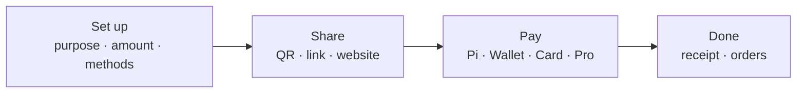
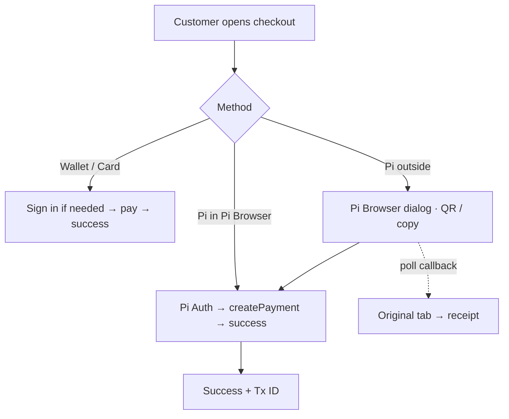

# OpenPay QR Pay — Landing Page UI/UX Showcase

A full visual & interaction brief for marketing, design, and landing-page builds.  
Describes the **real product UI** (Apple Pay–inspired light canvas) so the landing page can showcase QR Pay accurately.

**Live product:** [https://openpy.space/qr-pay](https://openpy.space/qr-pay)  
**Create:** [https://openpy.space/qr-pay/new](https://openpy.space/qr-pay/new)  
**Auth:** [https://openpy.space/auth](https://openpy.space/auth)

---

## Landing hero (recommended copy)

| Slot | Copy |
|------|------|
| **Eyebrow** | OpenPay QR Pay |
| **Headline** | Create a checkout. Share it. Get paid. |
| **Subhead** | Turn any phone into a branded payment page — QR, link, or website Pay button. Collect with Pi, Wallet, Virtual Card, or OpenPay Pro. |
| **Primary CTA** | Start accepting OpenPay → `/qr-pay` |
| **Secondary CTA** | See how it works → scroll / `#journey` |
| **Trust line** | No cart required · No fee on pay screen · Receipt every time |

**Hero visual direction:** Full-bleed soft mesh canvas (`#eef1f6` + blue/violet/green orbs). Center a **phone mock** of checkout (amount + black Pay with OpenPay button). Optional second device showing success green check. Brand mark **OpenPay** must read as hero-level — not only nav.

---

## Design system (product tokens)

Use these on the landing page so mocks match the app.

### Color

| Token | Hex | Role |
|-------|-----|------|
| `--qrp-ink` / Pay | `#1d1d1f` | Primary text, black CTAs, pay buttons |
| `--qrp-accent` | `#007AFF` | Links, selection, waiting states, “Maybe Later” |
| `--qrp-ok` | `#34C759` | Success check / paid |
| `--qrp-muted` | `#86868B` | Secondary labels |
| `--qrp-canvas` | `#EEF1F6` | Page background base |
| Surface | `#FFFFFF` | Sheets, cards, modals |
| Group fill | `#F2F2F7` | iOS Settings–style grouped lists |
| Line | `rgba(0,0,0,0.08)` | Hairlines / dividers |

**Background atmosphere (do not flatten):**
```
radial blue @ top-left · soft violet @ top-right · soft green @ bottom-right · warm orange whisper @ bottom-left
→ linear #f7f8fb → #eef1f6 → #e8ecf3
```

### Typography

- **Family:** Plus Jakarta Sans (fallback SF Pro Display / Text)
- **Display:** heavy weight, tracking `−0.04em` to `−0.05em`, tight line-height
- **Amounts:** oversized display (`qrp-amount-hero`) — currency muted, number ink
- **Section labels:** 11–12px uppercase / semibold tracking (e.g. `RECEIPT`, `RESOURCES`)
- **Body:** 15–16px, `#6E6E73` for supporting copy

### Shape & chrome

| Element | Spec |
|---------|------|
| Sheets / modals | `28px` corner radius, white, deep soft shadow |
| Primary CTA | Pill / full-width `rounded-full`, fill `#1d1d1f`, white label |
| Secondary | Text `#007AFF` (“Maybe Later”, Cancel) |
| Grouped rows | `#f2f2f7` container, white rows, 1px inset dividers |
| Logo badge | Outlined mark: `1.5px` border `#1d1d1f`, `14px` radius, logo + “OpenPay” |
| Pay button | Apple Pay–style: black bar + OpenPay wordmark (logo + word) |
| Watermark | Giant faded word behind stage: `PAY` / `SHARE` / `DONE` |

### Motion (ship 2–3 on landing)

1. **Page enter** — `qrp-pop`: scale `0.96 → 1`, fade in (~400ms)
2. **Stagger rise** — sheet children rise with 40–60ms delays
3. **Success** — green badge + expanding rings + check path draw (respect `prefers-reduced-motion`)
4. **CTA press** — `active: scale(0.98)`

---

## Product journey (4-step rail)

Every QR Pay screen shares this progress language — reuse on the landing page as a story strip.

```
Set up  →  Share  →  Pay  →  Done
```

| Step | User | UI cue |
|------|------|--------|
| **Set up** | Merchant creates purpose, amount, methods | Create form + purpose picker |
| **Share** | QR / link / website button | Share sheets + Mobile \| Website segment |
| **Pay** | Customer pays | Checkout + method rows + sticky pay bar |
| **Done** | Receipt | Green check + Tx ID + download/print/email |

Slim rail UI: 4 hairline bars; completed = ink fill + check icon; active label in ink; upcoming muted.

---

## Screen gallery (showcase blocks)

Use each block as a landing section with a device frame + short caption.

### 1. Guide modal — “Now Accepting OpenPay”

**Route trigger:** first visit on `/qr-pay`

| Layer | Content |
|-------|---------|
| Badge | Outlined OpenPay mark |
| Title | **Now Accepting OpenPay** |
| Body | Easy & secure QR / links — create, share, collect — no forms |
| Chip | `QR · Link · Website button` |
| Primary | Black pill: **Set Up** + OpenPay wordmark |
| Ghost | **Maybe Later** (blue text) |

**Landing caption:** *The same “accept payments” moment merchants see in-app.*

---

### 2. Merchant dashboard

**Route:** `/qr-pay`  
**Tabs:** Overview · Payment links · Orders

**Overview**
- KPI strip: available balance, revenue, today / week / month / year
- Method split: Pi · Wallet · Card (and Pro when used)
- Analytics area chart + top links
- Realtime toast when a payment arrives

**Payment links**
- List of checkouts: title, amount, status
- Actions: copy, preview, open, delete

**Orders (Shopify-style)**
- Expandable customer panels
- Initials avatar, contact (email / phone)
- Delivery address & notes
- Line items with qty × price
- Method badge + Tx ref

**Watermark word:** soft giant brand / stage mark behind content  
**Header:** frosted glass hero chrome (`backdrop-filter` blur)

**Landing caption:** *One place to create links, watch revenue, and open every customer order.*

---

### 3. Create checkout

**Route:** `/qr-pay/new`

**Composition (top → bottom)**
1. Steps rail on **Set up**
2. Cover photo dropzone (dashed / soft fill, blue “Add Cover Photo”)
3. Title + currency pill (flag + code)
4. **Purpose picker** — iOS Settings list, searchable, 9 categories
5. Line items **or** flexible amount chips (donation / tip family)
6. Method toggles: Pi · Wallet · Virtual Card · guest Pi
7. Advanced: reusable link, expiry, Pro settlement, after-pay download/redirect, delivery fields
8. Primary: **Create payment** (black full-width)

**Purpose categories to showcase in UI copy:**  
Commerce · Digital · Donations · Booking · Bills · Finance · Business · Personal · Crypto

**Landing caption:** *From product invoice to tip jar — pick a purpose, not a template maze.*

---

### 4. Share help — Mobile vs Website

**Modal after create**

- Same “Now Accepting OpenPay” badge + title
- Segmented control on `#f2f2f7`:
  - **Share link** (phone icon)
  - **Website** (monitor icon)
- Primary continues into share stage

**Share stage UI**
| Channel | Visual |
|---------|--------|
| **Mobile** | Large QR, copy link, native Share, preview checkout |
| **Website** | Live **Pay with OpenPay** button preview · iframe · widget · HTML snippet · optional QR embed |

Button style presets (match purpose): Plain · Buy · Pay · Donate · Tip · Checkout  
Themes: **Black** (default) / **White** outline

**Landing caption:** *In person? Show the QR. Online? Drop a Pay button — same checkout token.*

---

### 5. Customer checkout

**Route:** `/qr-pay/:token` (public)

#### Mobile
- Soft canvas + watermark
- Cover / merchant identity
- Display amount (currency muted, number hero)
- Item list or open amount field
- **No fee** callout
- Contact fields (+ delivery when enabled)
- Method rows (radio-style group): OpenPay Balance · Pi Network · Virtual Card · OpenPay Pro
- **Sticky bottom pay bar** — black Pay CTA with OpenPay wordmark

#### Desktop
- Split **desk** layout: left story (cover + amount), right pay panel
- Same methods & CTA, more breathing room

**Landing caption:** *Checkout that feels familiar the first time — brand, amount, pay.*

---

### 6. Pi Browser handoff

**When:** payer chooses Pi outside Pi Browser

**Modal (28px, white)**
- Title: open in Pi Browser
- Blue waiting banner: *Waiting for Pi payment…* (spinner)
- Numbered steps
- Short link + **Copy**
- Black CTA + “Get Pi Browser” blue link
- Alternate method escape

**Cross-browser UX:** original tab polls until paid → lands on receipt without losing context.

**Landing caption:** *Pay in Pi Browser. Get the receipt back where you started.*

---

### 7. Success / Done

**Route:** `/qr-pay/:token/success`

| Element | Spec |
|---------|------|
| Watermark | `DONE` |
| Badge | Green circle `#34C759` + white check draw |
| Rings | Soft expanding success rings |
| Title | Payment Successful |
| Amount | Display hero |
| Hint (Pi return) | Blue info card: close Pi Browser — other tab has receipt |
| Steps | Rail on **Done** |
| Receipt sheet | Tx ID · method · merchant · download / print / email |
| Digital / redirect | Extra primary CTA when configured |

**Landing caption:** *A receipt you can keep — Tx ID for disputes, share via email or print.*

---

### 8. Pay button (website embed)

Apple Pay–grade mark for merchant sites:

```
[ ● OpenPay ]     or     Pay with [ ● OpenPay ]
```

- Height ~50–52px, full pill or block
- Black fill / white text (or white theme)
- Logo + wordmark tracking `−0.03em`
- Style auto-picks from purpose (Donate / Tip / Buy / Pay)

**Landing caption:** *“Pay with OpenPay” — one button, your checkout behind it.*

---

## Landing page section map (recommended)

Build the page as **one composition per section** — no dashboard clutter in the hero.

| # | Section | Job | Visual |
|---|---------|-----|--------|
| 1 | **Hero** | Brand + one headline + one CTA | Full-bleed mesh + phone checkout |
| 2 | **Journey** | Set up → Share → Pay → Done | 4-step rail + 4 tiny screens |
| 3 | **Create** | Purpose catalog | Purpose picker mock |
| 4 | **Share** | Mobile vs Website | Segment control + QR / Pay button |
| 5 | **Checkout** | Customer trust | Amount + methods + sticky pay |
| 6 | **Pi-native** | Pi Browser story | Handoff modal frame |
| 7 | **Success** | Receipt moment | Green check + Tx ID |
| 8 | **Merchant OS** | Dashboard & Orders | KPI + order panel crop |
| 9 | **Methods** | How customers pay | Pi · Wallet · Card · Pro icons (not a card grid of fluff) |
| 10 | **CTA close** | Start accepting | Black pill + wordmark |

Avoid in first viewport: stats strips, schedule chips, multi-promo badges, floating stickers on the hero image.

---

## Interaction principles (copy for design / eng)

1. **One job per screen** — create, share, pay, or done — never mix.
2. **Thumb-first** — primary actions full-width; sticky pay on mobile.
3. **Ink for commit, blue for navigate** — black = pay / create; blue = secondary / links.
4. **Grouped lists over cards** — Settings-style rows; cards only when the interaction needs a container.
5. **Show the brand on the pay control** — wordmark lives on the button, not only in the header.
6. **Motion = hierarchy** — success and sheet entrance; no decorative noise.
7. **Honest empty states** — clear next step (“Create your first checkout”).
8. **Accessible reduced motion** — success rings / check draw disabled when preferred.

---

## Microcopy bank (landing + product-aligned)

| Context | Line |
|---------|------|
| Product | Accept payments with QR codes and links. |
| Guide | Create a checkout, share it with customers, and collect instantly — no forms required. |
| Share help | Share a link or QR, or add a Pay button to your website. |
| Channel | Which should I use? — Share link vs Website |
| Checkout | No fee |
| Pi wait | Waiting for Pi payment… |
| Pi return | Payment is complete. You can close Pi Browser — your original tab will open the receipt automatically. |
| Success | Payment Successful |
| Receipt | Keep this Transaction ID for any disputes or claims. |
| CTA | Set Up OpenPay · Maybe Later · Create payment · Pay with OpenPay |

---

## Device & layout specs for mocks

| Surface | Width | Notes |
|---------|-------|-------|
| iPhone frame | 390 × 844 | Primary hero device |
| Modal | max 380px, radius 28 | Guide / Share / Pi / Pro pickers |
| Desktop checkout | 2-col desk | Left media/amount, right pay sheet |
| Dashboard | 390 mobile / 1200 desk | Tabs under frosted header |

Safe areas: respect notch / home indicator padding on sticky pay bar.

---

## Accessibility & trust cues (landing bullets)

- High-contrast ink on light canvas  
- Clear focus / selection with `#007AFF` wash  
- Amount and method always visible before confirm  
- Tx ID on success for disputes  
- Pi path explains handoff instead of failing silently  

---

## Asset checklist for the landing build

- [ ] OpenPay logo mark (color + white)
- [ ] Outlined “OpenPay” badge (guide modal)
- [ ] Black **Pay with OpenPay** button (PNG/SVG + HTML sample)
- [ ] Sample QR (checkout URL pattern `openpy.space/qr-pay/{token}`)
- [ ] Phone mock: checkout
- [ ] Phone mock: success (green check)
- [ ] Phone mock: share (QR + segment)
- [ ] Phone mock: purpose picker
- [ ] Optional: Pi Browser dialog crop
- [ ] Soft mesh background (or CSS gradients from tokens above)
- [ ] Plus Jakarta Sans (or licensed equivalent)

---

## Flow diagram (embed on landing)





---

## Closing CTA block

**Headline:** Now Accepting OpenPay  
**Body:** Create a branded QR checkout in minutes. Share a link, show a QR, or embed Pay with OpenPay on your site.  
**Button:** Set Up OpenPay → [https://openpy.space/qr-pay](https://openpy.space/qr-pay)  
**Secondary:** Sign in with Pi → [https://openpy.space/auth](https://openpy.space/auth)

---

## Related docs

- Product blog: `BLOG_OPENPAY_QRPAY.md`
- Tokens / CSS: `src/index.css` (`.qrp-*`)
- Components: `src/components/qrpay/*`, `src/components/qr-pay/OpenPayPayButton.tsx`
- Screens: `QrPayDashboardPage`, `QrPayCreatePage`, `QrPayCheckoutPage`, `QrPaySuccessPage`
