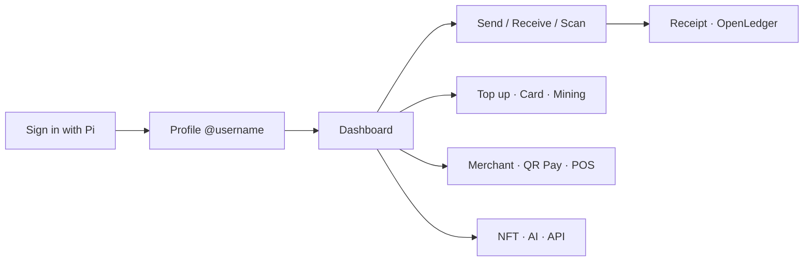

# OpenPay — Full Landing Page UI/UX Showcase

A complete visual & interaction brief for the **main OpenPay landing page** — every major product surface, in the same format as `LANDING_OPENPAY_QRPAY_UIUX.md`.  
Use this to build feature sections, phone mocks, CTAs, and a full-site sitemap.

**Live app:** [https://openpy.space](https://openpy.space)  
**Sign in:** [https://openpy.space/auth](https://openpy.space/auth)  
**QR Pay deep dive:** `LANDING_OPENPAY_QRPAY_UIUX.md` · `BLOG_OPENPAY_QRPAY.md`  
**Feature blog pack:** `BLOG_OPENPAY_ALL_FEATURES.md`

> Brand voice: modern fintech, Pi-native, transparent. PayPal-grade wallet UX + Apple Pay–clean checkout (QR Pay). Primary target: **Pi Browser**; full web everywhere else.

---

## Landing hero (recommended copy)

| Slot | Copy |
|------|------|
| **Eyebrow** | OpenPay |
| **Headline** | Your Pi wallet for send, sell, and settle |
| **Subhead** | Pay anyone with @username or QR. Run a store with POS and QR Pay. Fund with cards & crypto. Mint NFTs. Ask OpenPay AI. One identity — your Pi. |
| **Primary CTA** | Authenticate with Pi → `/auth` |
| **Secondary CTA** | Explore features → `#features` |
| **Trust line** | Pi Auth · Receipts & OpenLedger · Merchant POS · QR Pay · Virtual Card · NFT · AI |

**Hero visual direction:**  
Full-bleed soft mesh (light canvas) **or** signature OpenPay blue gradient behind a white auth card. Center brand **OpenPay** as hero-level signal (logo + wordmark). Optional phone stack: Dashboard · Send · QR Pay checkout · Success. Do **not** fill the first viewport with stats strips or feature grids.

---

## Design system (site-wide)

OpenPay has two related visual dialects — keep them consistent on the landing page.

### A. Wallet / portal (PayPal-grade)

| Token | Value | Role |
|-------|-------|------|
| Signature blue | `hsl(217 91% 60%)` ≈ `#3B82F6` / paypal-blue | Primary buttons, links, brand chrome |
| Ink | `#0F172A` / foreground | Headlines on light |
| Muted | slate / muted-foreground | Supporting copy |
| Surface | White cards, `rounded-2xl` | Auth card, lists, panels |
| Auth canvas | Blue gradient | Sign-in landing |

### B. QR Pay / checkout (Apple Pay–inspired)

| Token | Hex | Role |
|-------|-----|------|
| Ink / Pay | `#1D1D1F` | Black CTAs, pay buttons |
| Accent | `#007AFF` | Selection, secondary text CTAs |
| Success | `#34C759` | Paid / done |
| Canvas | `#EEF1F6` | Soft mesh page bg |
| Group | `#F2F2F7` | Settings-style lists |

### Shared rules

| Element | Spec |
|---------|------|
| Type | Plus Jakarta Sans (+ SF Pro fallbacks) |
| Display | Heavy weight, tracking `−0.03em` to `−0.05em` |
| Primary CTA | Pill or `rounded-2xl`, blue (wallet) **or** black + OpenPay wordmark (pay) |
| Secondary | Ghost / outline / blue text |
| Logo badge | Outlined mark: border `#1D1D1F`, logo + “OpenPay” |
| Pay control | **Pay with OpenPay** — logo + word on the button |
| Bottom nav | Floating mobile nav (Dashboard / Scan / Menu) |
| Motion | Enter fade/scale, stagger sheets, success check draw; respect reduced motion |

**Background atmosphere (light pages):**
```
radial blue · soft violet · soft green · warm whisper
→ linear #f7f8fb → #eef1f6 → #e8ecf3
```

**Auth / marketing pages:** solid or gradient blue with white central card is OK (matches `/auth`).

### Motion (2–3 on landing)

1. Hero brand + phone mock fade/rise  
2. Feature section stagger on scroll  
3. Optional success-check loop on pay demo  
4. CTA `active: scale(0.98)`

---

## Product pillars (landing IA)

Use these as **nav anchors** and section order:

```
Wallet → Get Paid → Merchant → Fund & Spend → Grow → Web3 → AI → Build → Trust
```

| Pillar | One-liner | Hero mock |
|--------|-----------|-----------|
| **Wallet** | Send, receive, request, activity | Dashboard + Send |
| **Get Paid** | QR, @username, links, invoices | Receive QR / Username Pay |
| **Merchant** | POS, QR Pay, catalog, portal | POS QR / QR Pay checkout |
| **Fund & Spend** | Top-up rails, Virtual Card, FX | Top-up picker / Card |
| **Grow** | Mining, staking, affiliate, remittance | Mining timer |
| **Web3** | NFT mint, auction, stores | NFT grid |
| **AI** | Chat that routes to features | AI chat empty state |
| **Build** | Partner API, QR Pay API, app payments | Dev keys screen |
| **Trust** | Pi Auth, MPIN/2FA, KYC, ledger, disputes | Auth + receipt |

---

## Master journey (Pioneer)



---

## Screen gallery — all features

Each block = one landing section (or carousel slide): **title · hero line · UI composition · CTA**.

---

### 1. Sign in with Pi
**Route:** `/auth`  
**Hero:** *One tap. Your Pi identity. Your OpenPay wallet.*

| UI | Detail |
|----|--------|
| Canvas | Blue gradient |
| Header | Logo + **OpenPay** + “Sign in to your wallet” |
| Card | White rounded card |
| Primary | Blue **Authenticate with Pi** |
| Secondary | **Sign In with Email** |
| Extra | **OpenPay Pro** → link picker |
| Resources | Pi Browser · Socials · Website · Blog · Pro |
| Footer | Terms · Privacy · About · Legal · GDPR · Whitepaper · User Guide |

**CTA:** [Sign in →](https://openpy.space/auth)

---

### 2. Onboarding & profile
**Route:** `/auth/setup-profile`  
**Hero:** *A wallet is only as trusted as its owner.*

- Full name, unique `@username` (3–20), profile photo  
- Powers QR receipts, invoices, OpenLedger identity  

**CTA:** [Set up profile →](https://openpy.space/auth/setup-profile)

---

### 3. Dashboard — money home
**Route:** `/auth/dashboard`  
**Hero:** *One screen. Every action a Pioneer needs.*

| Zone | Content |
|------|---------|
| Balance | Pi / preferred fiat |
| Quick actions | Send · Receive · Top-Up · Scan |
| Sections | Wallet, Savings, Credit, Loans, Cards, Buy, Swap, Mining, Analytics |
| Chrome | Floating bottom nav |
| Chips | Mining status, KYC badge, currency |

**CTA:** [Open dashboard →](https://openpy.space/auth/dashboard)

---

### 4. Express Send
**Route:** `/auth/send` · `/auth/send/pro`  
**Hero:** *Type a username. Confirm. Done.*

- Recipient: `@username` / contact / QR  
- Amount in local currency → Pi  
- Confirm with **MPIN** / biometric  
- Signed receipt → Activity  

**CTA:** [Send money →](https://openpy.space/auth/send)

---

### 5. Receive (QR & link)
**Route:** `/auth/receive`  
**Hero:** *Your QR is your storefront.*

- Personal QR with name + `@username`  
- Share link / chat  
- Same settlement as Username Pay  

**CTA:** [Receive →](https://openpy.space/auth/receive)

---

### 6. Username Pay
**Route:** `https://openpy.space/@username`  
**Hero:** *Your @name is your payment address.*

- Public pay page for streams, bios, cards  
- One-tap pay into wallet  

**CTA:** Claim `@username` via [profile setup](https://openpy.space/auth/setup-profile)

---

### 7. Request money
**Route:** `/auth/request-payment`  
**Hero:** *Stop chasing. Start requesting.*

- Bill by `@username` → notify → review → pay → dual receipts  
- Split bills, retainers, casual invoices  

**CTA:** [Request →](https://openpy.space/auth/request-payment)

---

### 8. Send invoice
**Route:** `/auth/send-invoice`  
**Hero:** *Invoicing that closes in seconds, not weeks.*

- Line items, tax, notes, due date  
- Pay-now link · auto receipt + Tx ID  

**CTA:** [Send invoice →](https://openpy.space/auth/send-invoice)

---

### 9. Payment links
**Route:** `/auth/payment-links/create`  
**Hero:** *Turn any URL into a Pi checkout.*

- Title, fixed or open amount, currency, success message  
- Bio / Telegram / email / QR  

**CTA:** [Create link →](https://openpy.space/auth/payment-links/create)

---

### 10. QR Scanner
**Route:** `/auth/qr-scanner`  
**Hero:** *If it has a QR, you can pay it.*

- Reads OpenPay, POS, and QR Pay tokens  
- Preview amount / recipient before confirm  

**CTA:** [Scan →](https://openpy.space/auth/qr-scanner)

---

### 11. QR Pay (merchant checkout)
**Routes:** `/qr-pay` · `/qr-pay/new` · `/qr-pay/:token` · `/qr-pay/:token/success`  
**Hero:** *Create a checkout. Share it. Get paid.*

**Journey rail:** Set up → Share → Pay → Done  

| Screen | UI highlight |
|--------|----------------|
| Guide | “Now Accepting OpenPay” modal |
| Create | Purpose catalog · cover · line items · methods |
| Share | Mobile QR **or** Website Pay button / iframe / HTML |
| Checkout | Amount hero · No fee · sticky black Pay with OpenPay |
| Pi outside | Pi Browser dialog + cross-tab receipt |
| Success | Green check · Tx ID · download / print / email |
| Dashboard | Overview · Payment links · Orders |

**Deep UI doc:** `LANDING_OPENPAY_QRPAY_UIUX.md`  
**CTA:** [QR Pay →](https://openpy.space/qr-pay)

---

### 12. Merchant POS
**Route:** `/auth/merchant-pos`  
**Hero:** *Your phone is your terminal.*

- Ring sale → session QR → paid confirmation  
- Thank-you + printable receipt  
- Cafés, markets, pop-ups, events  

**CTA:** [Open POS →](https://openpy.space/auth/merchant-pos)

---

### 13. Merchant portal & products
**Routes:** `/auth/merchant-onboarding` · `/auth/merchant-products` · `/auth/merchant-checkout`  
**Hero:** *Sell in Pi. Settle like a pro.*

- Onboarding, catalog (images, variants, stock)  
- Hosted checkout → thank-you  
- Analytics + API keys  

**CTA:** [Become a merchant →](https://openpy.space/auth/merchant-onboarding)

---

### 14. OpenPay buttons & public pay
**Routes:** `/auth/buttons` · `/auth/public-payment`  
**Hero:** *Drop a button. Get paid.*

- Embed Buy / Pay / Donate / Tip / Checkout  
- Public wallet pay page (simple “pay me”)  

**CTA:** Buttons & public payment via signed-in merchant tools

---

### 15. Top-Up Center
**Route:** `/auth/top-up` (also `/auth/topup`)  
**Hero:** *One wallet. Every rail.*

**Rails to showcase (icon row, not cluttered hero):**  
Stripe · PayPal · Venmo · Apple Pay · Google Pay · Cards · e-wallet QR (PH) · Solana Pay · USDC · USDT · OUSD · MRWN  

**CTA:** [Top up →](https://openpy.space/auth/top-up)

---

### 16. Virtual Card
**Route:** `/auth/virtual-card`  
**Hero:** *A card that lives inside your Pi wallet.*

- Provision · freeze · spend online  
- Masked PAN with eye toggle  
- Backed by OpenPay balance  

**CTA:** [Virtual card →](https://openpy.space/auth/virtual-card)

---

### 17. Currency converter
**Route:** `/auth/currency-converter`  
**Hero:** *Think in your currency. Pay in Pi.*

- 30+ fiat + PI  
- Sets app-wide preferred currency  
- Flags + live rates  

**CTA:** [Converter →](https://openpy.space/auth/currency-converter)

---

### 18. Activity & receipts
**Route:** `/auth/activity`  
**Hero:** *Every payment. Every receipt. Every time.*

- Searchable feed: counterparty, amount, method, status  
- Receipt with **Transaction ID** (disputes)  

**CTA:** [Activity →](https://openpy.space/auth/activity)

---

### 19. OpenLedger
**Route:** `/auth/ledger`  
**Hero:** *Trust, but verify. Then publish.*

- Public filterable ledger  
- Sender/receiver context  
- Mirrorable via API  

**CTA:** [OpenLedger →](https://openpy.space/auth/ledger)

---

### 20. Disputes
**Route:** `/auth/disputes`  
**Hero:** *Something wrong? File it. Fix it.*

- Paste Tx ID · evidence · status updates  
- Refunds settle to balance when approved  

**CTA:** [Disputes →](https://openpy.space/auth/disputes)

---

### 21. Mining
**Route:** `/auth/mining`  
**Hero:** *Watch. Mine. Repeat every 24 hours.*

- Ad-gated 24h cycle (Pi Ad Network)  
- Honest timer · rewards to balance  

**CTA:** [Mining →](https://openpy.space/auth/mining)

---

### 22. Staking
**Route:** `/auth/staking`  
**Hero:** *Idle Pi is lazy Pi.*

- Term · yield · lock-up shown upfront  
- Daily accruals  

**CTA:** [Staking →](https://openpy.space/auth/staking)

---

### 23. Swap & withdrawals
**Route:** `/auth/swap-withdrawal`  
**Hero:** *Convert. Withdraw. Move on.*

- Swap Pi / stables · withdraw rails  
- Every step receipted  

**CTA:** [Swap / withdraw →](https://openpy.space/auth/swap-withdrawal)

---

### 24. Remittance Center
**Route:** `/auth/remittance-center`  
**Hero:** *Borders are lines on a map. Money shouldn’t care.*

- Cross-border via Pi settlement  
- Local payout via partners · FX quotes · dual receipts  

**CTA:** [Remittance →](https://openpy.space/auth/remittance-center)

---

### 25. Contacts
**Route:** `/auth/contacts`  
**Hero:** *The people you pay most, one tap away.*

**CTA:** [Contacts →](https://openpy.space/auth/contacts)

---

### 26. Security — 2FA & MPIN
**Routes:** `/auth/two-factor` · `/auth/confirm-pin` · `/auth/forgot-mpin`  
**Hero:** *Security that respects your time.*

- Pi Auth + MPIN on pays + optional 2FA  
- MPIN recovery without support ticket  

**CTA:** [2FA →](https://openpy.space/auth/two-factor)

---

### 27. KYC & PiVerify
**Routes:** `/auth/kyc` · `/auth/kyc-status`  
**Hero:** *Verified once. Trusted everywhere in OpenPay.*

- Higher limits · merchant · remittance unlocks  
- Visible KYC badge  

**CTA:** [KYC →](https://openpy.space/auth/kyc)

---

### 28. Push notifications
**Route:** `/auth/notifications`  
**Hero:** *Know the moment money moves.*

- Payments, invoices, disputes, merchant orders  

**CTA:** [Notifications →](https://openpy.space/auth/notifications)

---

### 29. Affiliate
**Route:** `/auth/affiliate`  
**Hero:** *Bring Pioneers. Earn on their success.*

- `?ref=` link · rewards on join/transact  

**CTA:** [Affiliate →](https://openpy.space/auth/affiliate)

---

### 30. Developer — Smart Contract / OpenPay API
**Routes:** `/auth/developer-dashboard` · `/auth/smart-contract-api` · `/auth/openpay-api-docs`  
**Hero:** *OpenPay as a building block.*

- API keys · OAuth 2.0 · payments & ledger embeds  

**CTA:** [Developers →](https://openpy.space/auth/developer-dashboard)

---

### 31. QR Pay API
**Route:** `/qr-pay/api`  
**Hero:** *QR checkout you can automate.*

- Create/verify · keys · stats · kiosk/POS integrators  

**CTA:** [QR Pay API →](https://openpy.space/qr-pay/api)

---

### 32. App payments
**Route:** `/auth/app-payments`  
**Hero:** *One approval. One receipt. One wallet.*

- Third-party charge approval screen · native confirm  

**CTA:** [App payments →](https://openpy.space/auth/app-payments)

---

### 33. OpenPay AI
**Routes:** `/ai` · `/auth/openpay-ai`  
**Hero:** *Your money copilot.*

| UI | Detail |
|----|--------|
| Layout | Claude-style chat + sidebar |
| Sidebar | Avatar, `@username`, live balance |
| Empty | Suggestion chips (balance, KYC, mining…) |
| Actions | Send from chat · route to features · confirm/cancel |

**CTA:** [OpenPay AI →](https://openpy.space/ai)

---

### 34. Web3 & NFT Marketplace
**Routes:** `/web3` · `/web3/nft` · `/web3/nft/create` · `/web3/nft/store`  
**Hero:** *Creators get paid. Collectors get provenance.*

- Mint (image/GIF/video/audio) · fixed or live auction  
- Buy with balance / card / Pi  
- Creator store · gifts · global chat · status badges  
- Pay mint with same OpenPay checkout  

**CTA:** [NFT →](https://openpy.space/web3/nft) · [Create →](https://openpy.space/web3/nft/create)

---

### 35. OpenUSD ($OUSD)
**Hero:** *Utility stablecoin for commerce, mining, and swap.*

- Mining rewards · Pro assets · commerce settlement  
- Pro links: [openusd](http://openpaypro.space/openusd) · [Pro app](http://openpaypro4378.pinet.com)

---

### 36. Announcements & Feature Quest
**Routes:** `/auth/announcements` · `/auth/feature-quest`  
**Hero:** *Learn OpenPay by using OpenPay.*

**CTA:** [Announcements](https://openpy.space/auth/announcements) · [Quest](https://openpy.space/auth/feature-quest)

---

### 37. Help, wiki & live support
**Routes:** `/auth/help` · `/auth/help-wiki` · `/auth/live-support`  
**Hero:** *Answers first. Humans when needed.*

**CTA:** [Help](https://openpy.space/auth/help) · [Wiki](https://openpy.space/auth/help-wiki)

---

### 38. Legal & regulatory
**Routes:** `/auth/terms` · `/auth/privacy` · `/auth/gdpr` · `/auth/regulatory-status` · `/auth/pi-mica-whitepaper`  
**Hero:** *Transparency isn’t a feature. It’s the floor.*

---

### 39. Desktop, about, partners, pitch
**Routes:** `/auth/openpay-desktop` · `/auth/download` · `/auth/about` · `/auth/open-partner` · `/auth/socials` · `/auth/pitch-deck` · `/auth/whitepaper`

**CTA:** [About](https://openpy.space/auth/about) · [Pitch deck](https://openpy.space/auth/pitch-deck) · [Whitepaper](https://openpy.space/auth/whitepaper)

---

### 40. OpenPay Pro (ecosystem)
**Picker on auth:** OpenPay Pro · Website · OpenUSD · About · Blog · Wiki  

| Link | URL |
|------|-----|
| OpenPay Pro | http://openpaypro4378.pinet.com |
| Website | http://openpaypro.space/website |
| OpenUSD ($OUSD) | http://openpaypro.space/openusd |
| About | http://openpaypro.space/about |
| Blog | http://openpaypro.space/blog |
| Wiki | http://openpaypro.space/wiki |

---

## Recommended landing page section map

One job per section. Brand-first hero. No card spam in the first viewport.

| # | Section ID | Job | Visual |
|---|------------|-----|--------|
| 1 | `#hero` | Brand + one headline + CTA | Mesh/blue + OpenPay mark + 1 phone |
| 2 | `#how` | How OpenPay works | 4 steps: Sign in → Pay → Sell → Grow |
| 3 | `#wallet` | Everyday money | Dashboard + Send + Receive mocks |
| 4 | `#get-paid` | QR · @username · links · invoices | Receive QR + Username Pay |
| 5 | `#merchant` | POS + QR Pay | POS phone + QR Pay checkout |
| 6 | `#qr-pay` | Deep checkout story | Share Mobile/Website + Pay button |
| 7 | `#fund` | Top-up & card | Rail icons + Virtual Card |
| 8 | `#grow` | Mining · stake · affiliate · remittance | Mining timer crop |
| 9 | `#web3` | NFT marketplace | NFT grid / auction |
| 10 | `#ai` | OpenPay AI | Chat UI crop |
| 11 | `#build` | APIs | Dev dashboard / keys |
| 12 | `#trust` | Auth · MPIN · KYC · Ledger · Disputes | Auth card + receipt |
| 13 | `#cta` | Close | Authenticate with Pi |

Optional footer strip: Legal · GDPR · Socials · Blog · Pro · Download Pi Browser

---

## Feature grid (compact — for `#features` or sitemap)

| Feature | CTA path |
|---------|----------|
| Pi Auth | `/auth` |
| Dashboard | `/auth/dashboard` |
| Send | `/auth/send` |
| Receive | `/auth/receive` |
| Request | `/auth/request-payment` |
| Invoice | `/auth/send-invoice` |
| Payment Links | `/auth/payment-links/create` |
| QR Scanner | `/auth/qr-scanner` |
| QR Pay | `/qr-pay` |
| Merchant POS | `/auth/merchant-pos` |
| Merchant Onboarding | `/auth/merchant-onboarding` |
| Products | `/auth/merchant-products` |
| Top-Up | `/auth/top-up` |
| Virtual Card | `/auth/virtual-card` |
| Converter | `/auth/currency-converter` |
| Activity | `/auth/activity` |
| OpenLedger | `/auth/ledger` |
| Disputes | `/auth/disputes` |
| Mining | `/auth/mining` |
| Staking | `/auth/staking` |
| Swap / Withdraw | `/auth/swap-withdrawal` |
| Remittance | `/auth/remittance-center` |
| Contacts | `/auth/contacts` |
| 2FA / MPIN | `/auth/two-factor` |
| KYC | `/auth/kyc` |
| Notifications | `/auth/notifications` |
| Affiliate | `/auth/affiliate` |
| Developer API | `/auth/developer-dashboard` |
| QR Pay API | `/qr-pay/api` |
| App Payments | `/auth/app-payments` |
| OpenPay AI | `/ai` |
| NFT Marketplace | `/web3/nft` |
| Feature Quest | `/auth/feature-quest` |
| Help / Wiki | `/auth/help` |
| Pitch / Whitepaper | `/auth/pitch-deck` · `/auth/whitepaper` |

---

## Interaction principles

1. **Brand first** — OpenPay is the hero signal, not a nav afterthought.  
2. **One job per section** — one headline, one supporting line, one visual.  
3. **Pi-native path** — always show Authenticate with Pi as primary.  
4. **Thumb-first** — full-width CTAs; floating bottom nav in wallet mocks.  
5. **Ink commits, blue navigates** — black pay / create; blue links & secondary.  
6. **Wordmark on pay** — OpenPay lives on the payment button.  
7. **Receipts everywhere** — Tx ID is the trust artifact.  
8. **Cards only when interactive** — avoid decorative card grids in heroes.  
9. **Real product UI** — prefer screenshots / accurate mocks over abstract gradients alone.  
10. **Reduced motion** — disable decorative loops when preferred.

---

## Microcopy bank

| Context | Line |
|---------|------|
| Auth | Sign in to your wallet |
| Auth CTA | Authenticate with Pi |
| Guide | Now Accepting OpenPay |
| QR Pay | Create a checkout, share it with customers, and collect instantly — no forms required. |
| Dashboard | Your money home |
| Send | Type a username. Confirm. Done. |
| Receive | Your QR is your storefront. |
| Username | Your @name is your payment address. |
| POS | Your phone is your terminal. |
| Top-up | One wallet. Every rail. |
| Card | A card that lives inside your Pi wallet. |
| Ledger | Trust, but verify. Then publish. |
| Mining | Watch. Mine. Repeat every 24 hours. |
| AI | Your money copilot. |
| NFT | Creators get paid. Collectors get provenance. |
| API | OpenPay as a building block. |
| Trust footer | By continuing, you agree to our Terms and Privacy Policy |

---

## Device & mock specs

| Surface | Size | Use |
|---------|------|-----|
| iPhone | 390×844 | Primary hero & feature phones |
| Auth card | ~380 wide | Sign-in composition |
| QR Pay modal | max 380, r=28 | Guide / Share / Pi handoff |
| Desktop desk | 2-col | QR Pay checkout desktop |
| Dashboard | 390 / 1200 | Wallet home |

**Asset checklist**
- [ ] OpenPay logo (color + white)  
- [ ] Outlined OpenPay badge  
- [ ] Auth screen mock  
- [ ] Dashboard mock  
- [ ] Send / Receive / Scan mocks  
- [ ] POS QR mock  
- [ ] QR Pay: create · share · checkout · success  
- [ ] Pay with OpenPay button SVG  
- [ ] Virtual Card mock  
- [ ] Top-up rail icons  
- [ ] NFT marketplace crop  
- [ ] AI chat crop  
- [ ] Success green check  
- [ ] Soft mesh + blue auth backgrounds  
- [ ] Plus Jakarta Sans  

---

## Closing CTA block

**Headline:** OpenPay — wallet, merchant, and Web3 on Pi  
**Body:** Sign in with Pi. Send and get paid with QR or @username. Run POS and QR Pay. Fund, spend, mine, mint, and build — with receipts and OpenLedger.  
**Primary:** Authenticate with Pi → [https://openpy.space/auth](https://openpy.space/auth)  
**Secondary:** Open QR Pay → [https://openpy.space/qr-pay](https://openpy.space/qr-pay) · NFT → [https://openpy.space/web3/nft](https://openpy.space/web3/nft) · AI → [https://openpy.space/ai](https://openpy.space/ai)

---

## Related docs

| Doc | Purpose |
|-----|---------|
| `LANDING_OPENPAY_QRPAY_UIUX.md` | QR Pay–only landing UI/UX |
| `BLOG_OPENPAY_QRPAY.md` | QR Pay long-form blog |
| `BLOG_OPENPAY_ALL_FEATURES.md` | Per-feature CMS blog pack |
| `BLOG_OPENPAY_FEATURES.md` | Feature guide |
| `BLOG_OPENPAY_AI.md` | AI deep dive |
| `BLOG_OPENPAY_NFT.md` | NFT deep dive |
